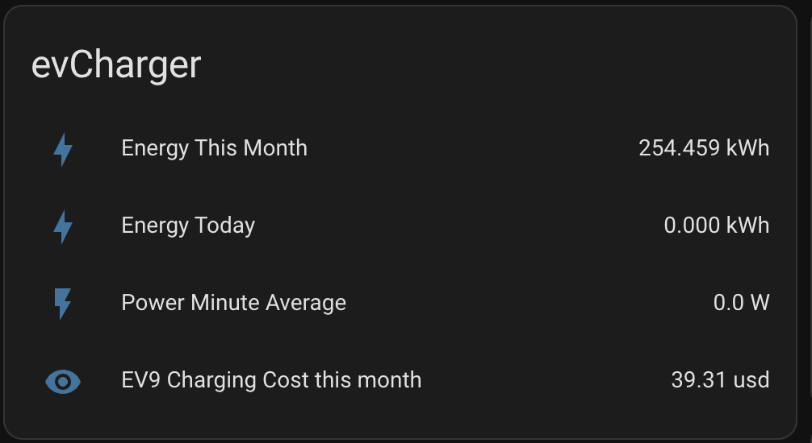
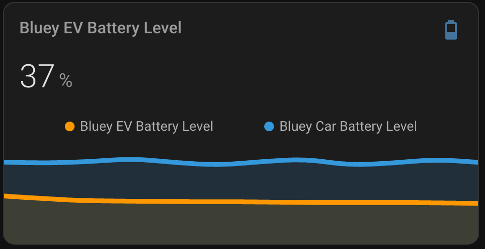

# ev9-homeassistant-graphs
Home assistant helpers and graphs to expose data from a Kia EV9

# Prerequisites
The prerequisites to run these scripts are:
* A working [Home Assistant](https://www.home-assistant.io/installation/) installation and admin rights to the host
* Home Assistant [HACS](https://www.hacs.xyz/docs/use/configuration/basic/) installed and working
* HACS installation of [Kia UVO](https://github.com/Hyundai-Kia-Connect/kia_uvo)

# Contents
## Introduction
I leased my Kia EV9 in the fall of 2024. As a Home Assistant nerd, I have enjoyed the data that the Kia APIs provide about my driving and charging habits.

## Lease Mileage Remaining

[HOW-TO Lease Mileage Remaining](lease-mileage-remaining.md)

If you are a lessee like me, you may have concerns that you are going over your mileage limits. This is the quickest way to incur a huge overage bill from Kia.

This template helper and graph help understand, with real-time data, whether you are over, under, or just about at your allotted mileage given your lease term. You customize the values when you upload the template. Then, I will show you how to create a gauge to display it on your dashboard.

[HOW-TO Lease Mileage Remaining](lease-mileage-remaining.md)

## Charger Statistics

[HOW-TO Charger Statistics](charger-statistics.md)

I use an [Emporia](https://www.amazon.com/dp/B0CKKPTDPK/ref=dp_iou_view_item?ie=UTF8&th=1}) charger that provides a sensor "sensor.evcharger_energy_this_month" that can be used to calculate how much money you have spent on electricity.

To get an accurate price / per kilowatt hour, instead of using the utility company's stated price per kWh, I prefer to include all the taxes, riders, and fees they lump into your bill. To do that, divide (total_bill_amount) / (net_supplied_energy - net_supplied_customer_to_grid) since I have solar panels as well. Our utility quotes $0.13/kWh on the rate schedule, but actual price is $0.154/kWh with fees and riders included. 

[HOW-TO Charger Statistics](charger-statistics.md)

## Basic High Voltage and 12V battery graphs
These are not custom made. This is just an example of adding sensors from the EV9 to my dashboard and graphing them.

# Credit

Big shout out to my wife, Melissa, who took the kids out for a sleepover so that I could get this working without interruptions!

Big shoutout to reddit [r/homeassistant](https://www.reddit.com/r/homeassistant/) and [r/KiaEV9](https://www.reddit.com/r/KiaEV9/) for all of the tips and inspiration to nerd out on this and upcoming projects.