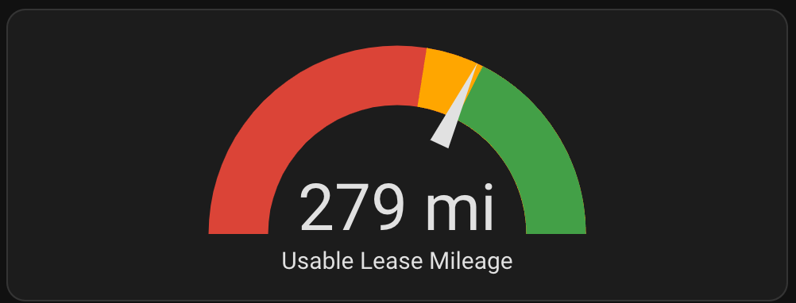
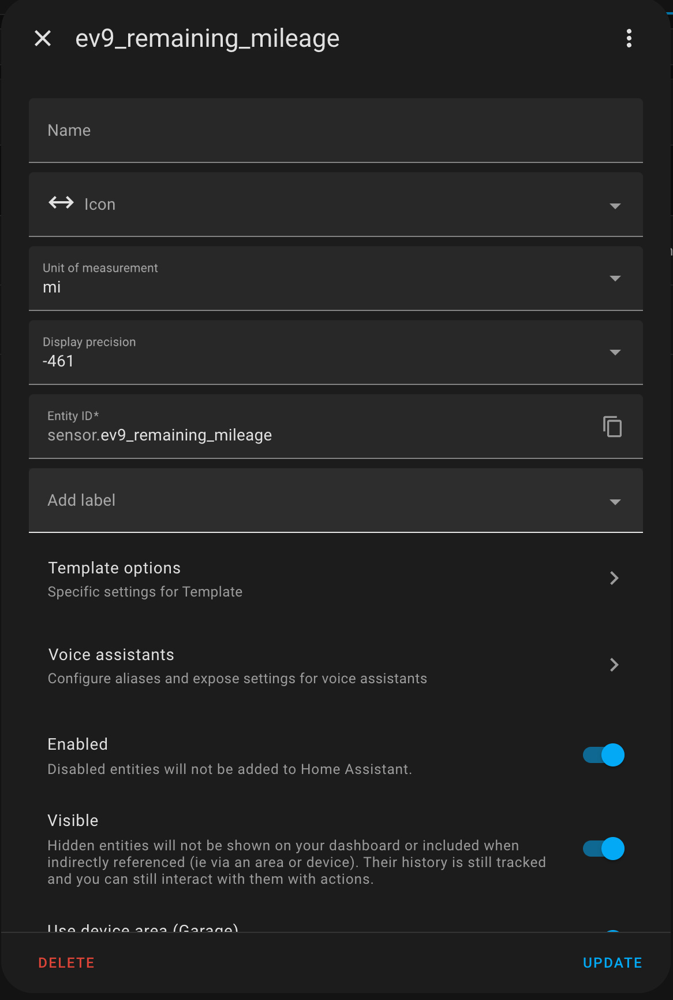
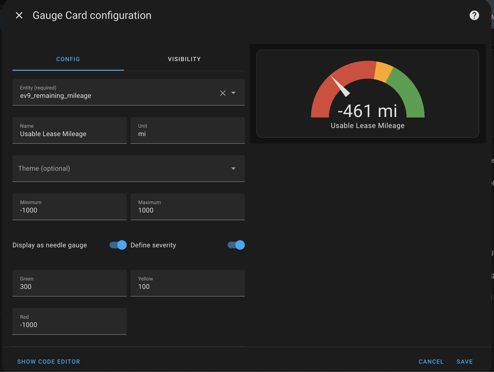

# Lease Mileage Remaining

Make sure you have satisfied the [Prerequisites](README.md#prerequisites).

If you are a lessee like me, you may have concerns that you are going over your mileage limits. This is the quickest way to incur a huge overage bill from Kia.

This template helper and graph help understand, with real-time data, whether you are over, under, or just about at your proscribed mileage given your lease term. You customize the  values when you upload the template. Then, I will show you how to create a gauge to display it on your dashboard.



## Setup

### Create the Helper
1. Log into your Home Assistant dashboard
1. Click *Settings* -> *Devices & services* 
1. On the top navigation bar, click *Helpers*
1. Click *Create Helper*
1. Click *Template* -> *Template sensor*
1. Name it something like "ev9_remaining_mileage" or similar
1. Paste and *customize* these values:

```
        
        
        
        
        
        
        
        
        {{ (odometer - allowed_miles_today)  }}
```

8. Ensure you have added your data in the following fields:
lease_start , lease_end , annual_mileage_allowance , lease_years 
9. *Unit of Measurement* should be set to either mi or km
10. *Device Class* should be set to *Distance*
11. *State Class* should be set to *Measurement*
12. *Device* should be set to your car's device name.
13. At this point, Preview should display a numeric value for you to use. It is not accurate yet.
14. Submit the helper.



## Create the gauge
This adds the UI component.

1. Navigate the the Edit view of the dashboard
1. Click "Add Card"
1. Search for "Gauge" and click it
1. Click "Show Code Editor"
1. Paste this in:
```
type: gauge
entity: sensor.ev9_remaining_mileage
name: Usable Lease Mileage
unit: mi
needle: true
severity:
  green: 300
  yellow: 100
  red: -1000
max: 1000
min: -1000
```
and save it.



6. You can customize the Green/Yellow/Red thresholds to match your driving habits. These are set for someone who averages 50 miles / week with occasional road trips.